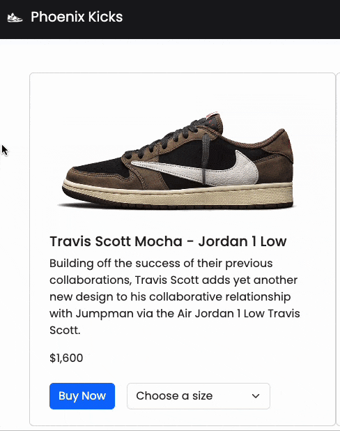

# E-commerce Website
## Capstone Project for PluralSight

### Project Description
For this capstone project, we leveraged our knowledge of HTML, CSS, and Bootstrap to create a comprehensive e-commerce website. The final site includes five pages and incorporates various essential HTML elements, such as tables, forms, images, lists, semantic HTML elements, and Bootstrap components.

### Approach
For my project, I chose to create a website dedicated to rare sneakers, inspired by my passion for streetwear. Key influences for the site’s design and functionality include:
- [Bodega](https://bdgastore.com/)
- [StockX](https://stockx.com/)
- [Off-White](https://www.off---white.com/en-us/)

The first step was establishing a cohesive theme to guide the site's design. Without a clear theme, I felt directionless. After working on the navigation bar and footer, I settled on a design that matched my vision.

With the theme in place, I focused on incorporating the required HTML elements on each page before delving into customization.

### Favorite Component
My favorite feature of the project is the image flip on hover. Implementing this effect was challenging due to the project's language constraints, but I am very pleased with the result. Below is a GIF demonstrating the effect.

### Lessons Learned and Pre-Presentation Thoughts
The most significant lesson I learned was how to properly structure a website. Additional insights include:
- 95% of desired functionalities already exist.
- Bootstrap simplifies development significantly.
- Solutions to almost any issue can be found online.
- Patience and systematic troubleshooting are crucial when things break.

Initially, I set high aspirations for this project but had to recalibrate my goals due to time constraints. Some components were not thoroughly debugged, but the overall experience was immensely educational.

### Post-Presentation Reflections
I am always eager to learn and improve. I recognize that there is still much to learn, and I am grateful for the support of my instructor, Gregor Dzierzon, and my classmates.

This was my first project using HTML, Bootstrap, and CSS. Despite the challenges, it was a valuable learning experience. I look forward to revisiting and improving this website as my skills develop.

Thank you for taking the time to read this.

